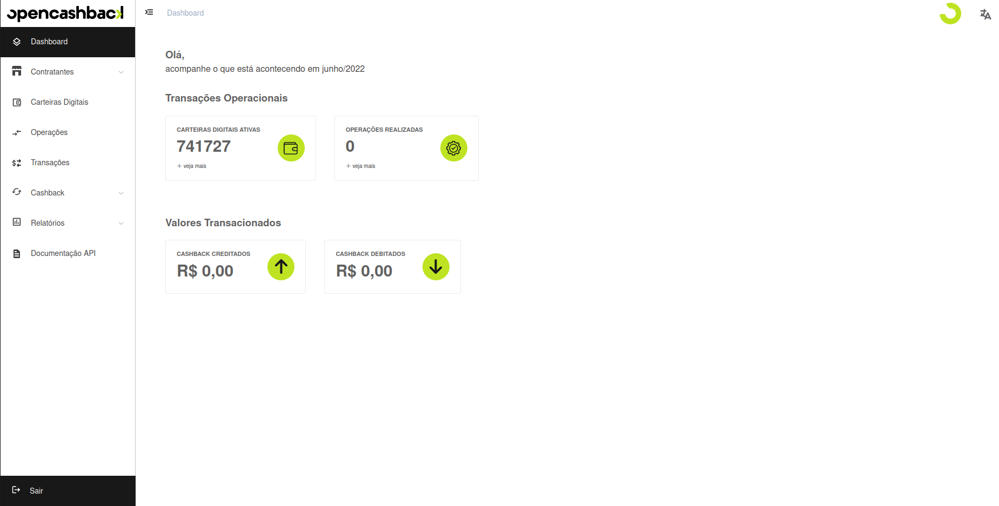

# Error Codes in OpenCashBack

<!--  -->

Algo correu mal em **Opencashback**? Não se preocupe. Afinal de contas, é por isso que estamos aqui. 

Se recebeu um código de erro, há a possibilidade de haver um número em anexo. Basta encontrar o seu número para saber o seu significado.

## Códigos
- ## BLK (Blacklist)

    | Código  | Motivo |
    | ------------- | ------------- |
    | **BLK-002**  | O produto que está tentando criar já existe em sua **Blacklist**.  |
    | **BLK-003**  | Erro inesperado na criação do produto.  |
    | **BLK-004**  | Erro inesperado ao tentar deletar o produto.  |
    | **BLK-005**  | Erro inesperado na listagem de produtos.  |

## Códigos OCB

- ### OCB

    | Código  | Motivo |
    | ------------- | ------------- |
    | **OCB-001**  | Usuário não tem acesso ao recurso que está tentando acessar.  |

     
